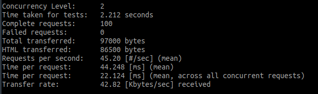
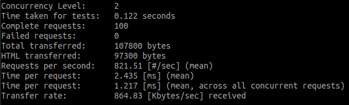
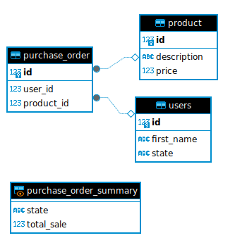

# View Materializada

   

Utilizando o conceito de view materializada para otimizar consultas complexas (CQRS pattern).


### Passo 1 - Rodando a aplicação

```bash
# subir container do banco de dados (docker)
docker-compose up -d

# subir microserviço (vai subir a carga automaticamente)
./gradlew bootRun
```

### Passo 2 - Instalação do Apache Benchmark (ab)

```bash
sudo apt-get install apache2-utils
```
Site: https://httpd.apache.org/docs/2.4/programs/ab.html

### Passo 3 - Rodar o teste de carga

Volumentria de 100.000 registros na tabela principal

#### 1 - Teste com query normal (multiplos joins)

```bash
# Executar 100 vezes com 2 requests em paralelo
ab -n 100 -c 2 http://localhost:8080/query-with-tables
```


#### 2 - Teste com a view materializada
```bash
# Executar 100 vezes com 2 requests em paralelo
ab -n 100 -c 2 http://localhost:8080/query-with-view
```


Observe que o resultado da view materializada é muito mais rápido que a consulta normal.

### Passo 4 - Informações complementares

#### Diagrama (DER)

| Table          | Rows    |
|----------------|---------|
| users          | 10.000  |
| product        | 1.000   |
| purchase_order | 100.000 |



#### Query

```sql
select
    u.state,
    sum(p.price) as total_sale
from
    users u,
    product p,
    purchase_order po
where
    u.id = po.user_id
    and p.id = po.product_id
```

### Passo 5 - Conclusão

O uso de view materializada é uma técnica muito eficiente para otimizar consultas complexas, principalmente em sistemas que possuem muitos dados. 
A view materializada é uma tabela que armazena o resultado de uma consulta, permitindo que a aplicação consulte essa tabela em vez de executar a consulta original. 
Isso pode melhorar significativamente o desempenho da aplicação, especialmente em consultas que envolvem muitas tabelas ou operações complexas.
